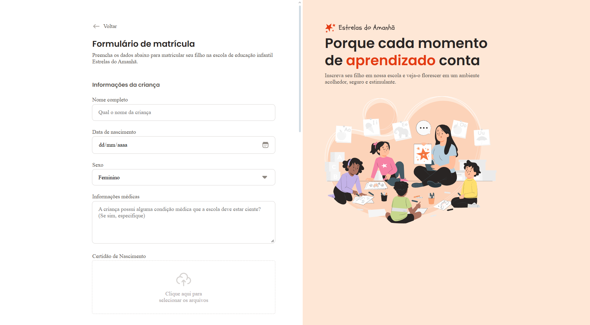

# Project:  Registration Form

This project is a clean and functional registration form built from scratch using only HTML and CSS. It showcases the ability to structure various input types (text, email, dropdown, textarea) and apply styling for a user-friendly interface.

## ✨ Technologies Used

## 🚀 Live Demo & Screenshot

*Click on the image below to see the live project and test the form.*

---
